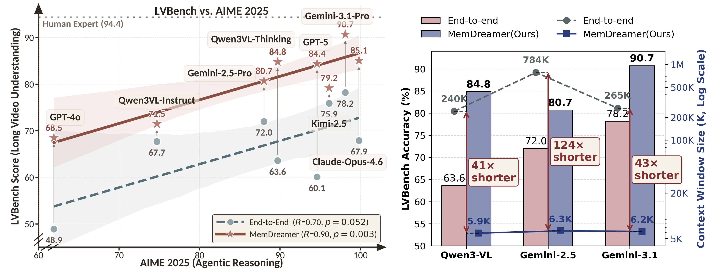
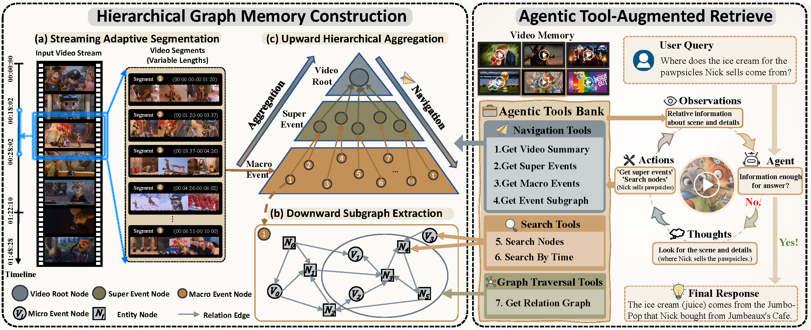

<h1 align="center">MemDreamer: Decoupling Perception and Reasoning for Long Video Understanding via Hierarchical Graph Memory and Agentic Retrieval Mechanism</h1>

<p align="center">
  <a href="https://arxiv.org/abs/2606.07512"></a>
  <a href="https://aim-uofa.github.io/MemDreamer/"></a>
  <a href="https://huggingface.co/datasets/inclusionAI/MemDreamer"></a>
  <a href="LICENSE"></a>
</p>

<p align="center">
Cong Chen<sup>1,2,*</sup>,&nbsp;
Guo Gan<sup>2,*</sup>,&nbsp;
Kaixiang Ji<sup>1,*</sup>,&nbsp;
Zhaoyang Zhang<sup>1,3</sup>,&nbsp;
Zhen Yang<sup>4</sup>,&nbsp;
Guangming Yao<sup>1</sup>,&nbsp;
Hao Chen<sup>2</sup>,&nbsp;
Jingdong Chen<sup>1</sup>,&nbsp;
Yi Yuan<sup>1</sup>,&nbsp;
Chunhua Shen<sup>1,2,&dagger;</sup>
</p>

<p align="center">
<sup>1</sup>Ant Group &nbsp; <sup>2</sup>Zhejiang University &nbsp; <sup>3</sup>Central South University &nbsp; <sup>4</sup>HKUST(GZ)<br>
<sub>* Equal Contribution &nbsp; &dagger; Corresponding Author</sub>
</p>

<p align="center">
  
</p>

---

## TL;DR

**MemDreamer** decouples perception and reasoning for long video understanding. It streams videos to build a **Hierarchical Graph Memory** (Video Root → Super Events → Macro Events → Entity/Event Subgraphs), then employs **agentic tool-augmented retrieval** via an Observation-Reason-Action loop to answer questions, achieving **SOTA across 4 benchmarks**, narrowing the gap with human experts to just **3.7 points**.

---

## News

- **[2026/06]** Release retrieve code, memory files, and inference trajectories.

---

## Todo

- [x] Release memory files and agent retrieval trajectories on [HuggingFace](https://huggingface.co/datasets/inclusionAI/MemDreamer)
- [x] Release agentic retrieval code
- [ ] Release memory construction code
- [ ] Submit results to benchmark leaderboards (LVBench, LongVideoBench, Video-MME, EgoSchema)

---

## Architecture

<p align="center">
  
</p>

**Left:** Memory construction — streaming adaptive segmentation, downward subgraph extraction, and upward hierarchical aggregation. **Right:** Agentic tool-augmented retrieval — three tool categories (Hierarchical Navigation, Precise Search, Graph Traversal) drive an Observation-Reason-Action loop.

---

## Getting Started

### Installation

```bash
git clone 
cd MemDreamer
pip install -r requirements.txt
```

### Reproduce Results

Download the pre-built memory and inference trajectories from [HuggingFace](https://huggingface.co/datasets/inclusionAI/MemDreamer), then:

```bash
python retrieve/scripts/check_progress.py <trajectory_dir> \
    --data data/LVBench/video_info.meta.jsonl
```

### Run Retrieval

See [`retrieve/README.md`](retrieve/README.md) for detailed instructions on:
1. Precomputing embeddings
2. Starting embedding servers
3. Running the agentic retrieval loop
4. Using custom LLM backends

---

## Citation

If you find MemDreamer useful, please cite:

```bibtex
@misc{chen2026memdreamerdecouplingperceptionreasoning,
      title={MemDreamer: Decoupling Perception and Reasoning for Long Video Understanding via Hierarchical Graph Memory and Agentic Retrieval Mechanism}, 
      author={Cong Chen and Guo Gan and Kaixiang Ji and ChaoYang Zhang and Zhen Yang and Guangming Yao and Hao Chen and Jingdong Chen and Yi Yuan and Chunhua Shen},
      year={2026},
      eprint={2606.07512},
      archivePrefix={arXiv},
      primaryClass={cs.CV},
      url={https://arxiv.org/abs/2606.07512}, 
}
```

---

## Acknowledgement

This work is supported by the Ant Group Research Internship Program.
